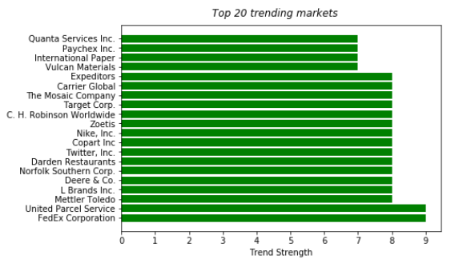
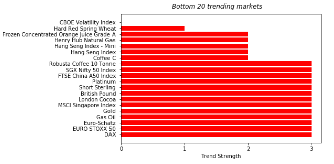
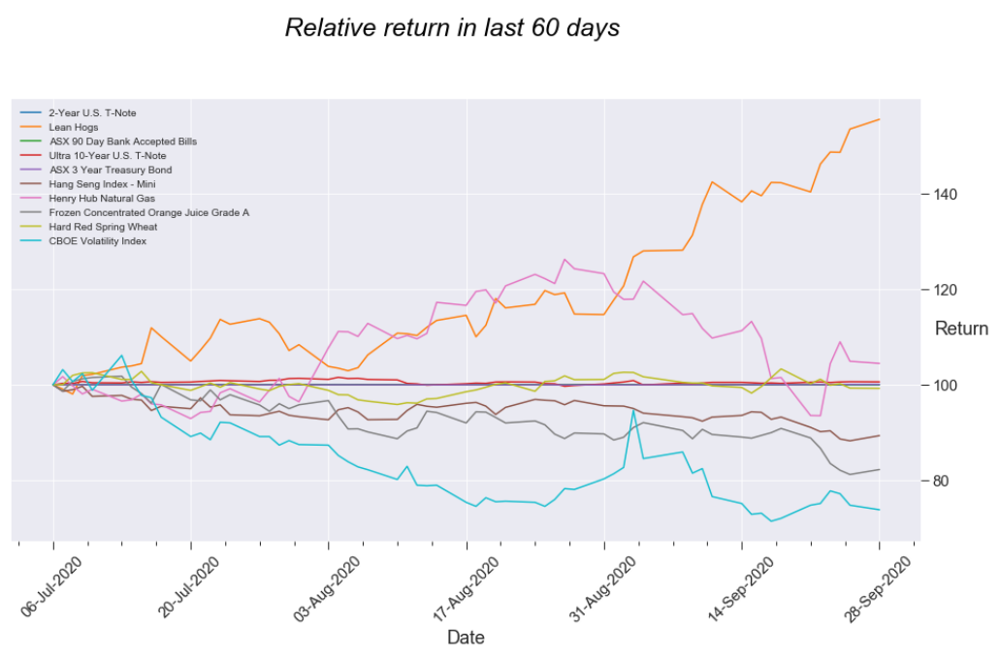
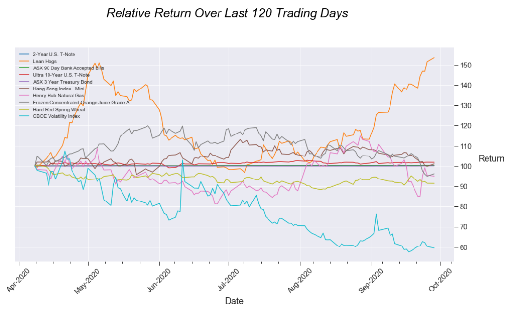
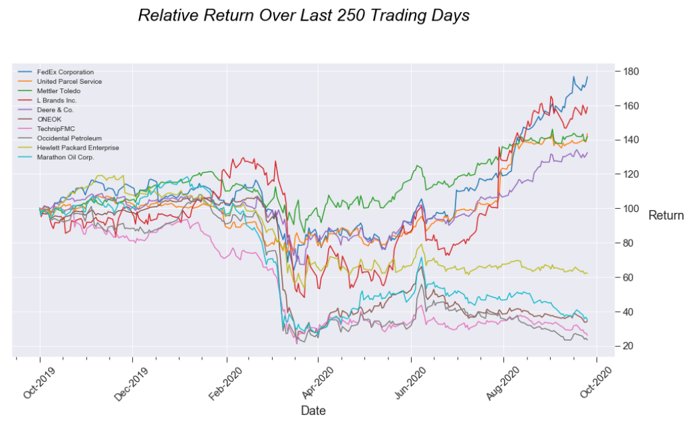
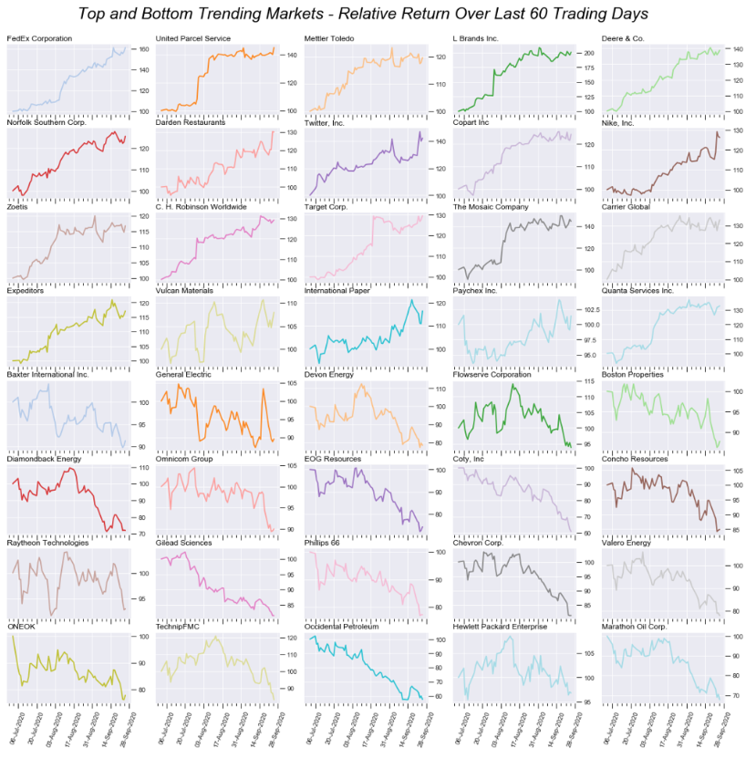
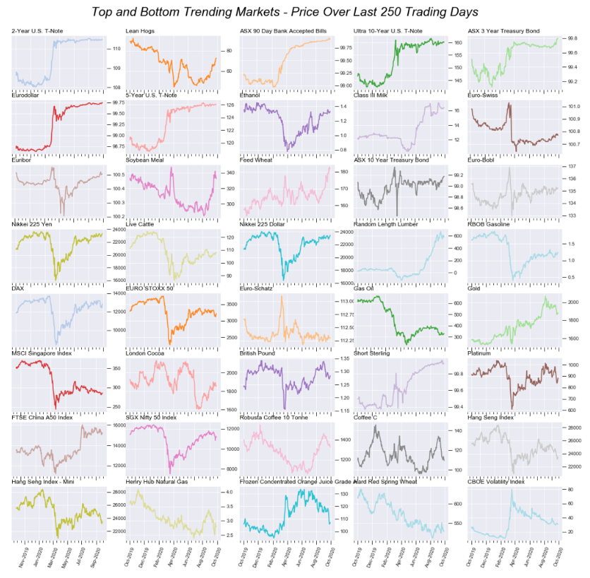

# trendbarometer
## Measure which markets are more strongly trending. 

### The library provides methods to:
  - Extract historical OHLC data for commodities from Norgate Data and S&P 500 from Yahoo Finance.
  - Calculate technical indicators over a range of time periods and aggregate to determine trend strength. 
  - Display charts of markets based on trend strength:
####	- Bar chart

####	- Line chart

####    - Multiple chart grid

  