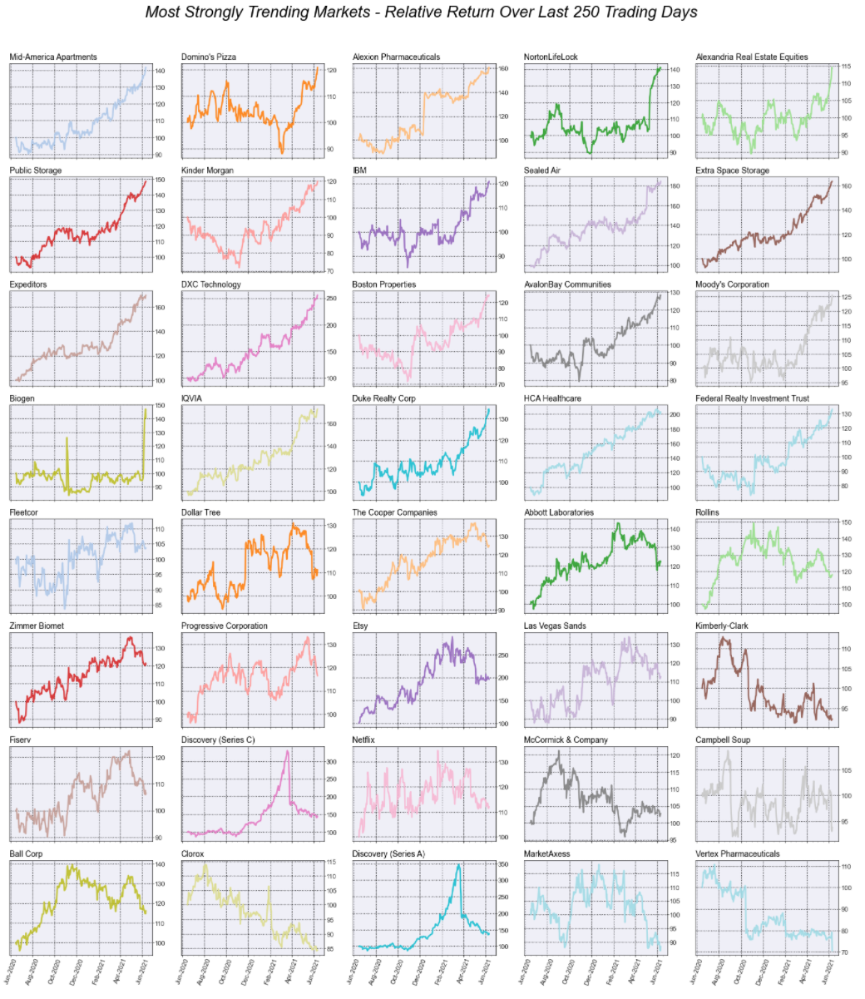

# trendvisualizer
## Visualize trend strength across various markets.

&nbsp;

### The library provides methods to:
  - Extract historical OHLC data for futures and cash commodities from Norgate Data and S&P 500 from Yahoo Finance (Norgate Data requires a subscription to the futures package:
  https://norgatedata.com/futurespackage.php).
  - Calculate technical indicators over a range of time periods and aggregate to determine trend strength. 
  - Display charts of markets based on trend strength.


&nbsp;

### Installation
Install from PyPI:
```
$ pip install trendvisualizer
```

&nbsp;

Install in a new environment using Python venv:

Create base environment of Python 3.13
```
$ py -3.13 -m venv .venv
```
Activate new environment
```
$ .venv\scripts\activate
```
Ensure pip is up to date
``` 
$ (.venv) python -m pip install --upgrade pip
```
Install Spyder
```
$ (.venv) python -m pip install spyder
```
Install package
```
$ (.venv) python -m pip install trendvisualizer
```


&nbsp;

To install in new environment using anaconda:
```
$ conda create --name trendvis
```
Activate new environment
```
$ activate trendvis
```
Install Python
```
(trendvis) $ conda install python==3.13
```
Install Spyder
```
(trendvis) $ conda install spyder
```

Install trendvisualizer
```
(trendvis) $ python -m pip install trendvisualizer
```

&nbsp;

### Setup
Import trend module

```
from trendvisualizer.trend import TrendStrength
```
Initialise a TrendStrength object which will extract market data, calculate indicators and trend strength
```
mkt = TrendStrength()
```

&nbsp;

####	Display Bar chart
```
mkt.chart(chart_type='bar', mkts=20, trend='up')
```


```
mkt.chart(chart_type='bar', mkts=15, trend='down')
```


```
mkt.chart(chart_type='bar', mkts=20, trend='neutral')
```


&nbsp;

####	Display Line chart
```
mkt.chart(chart_type='returns', days=60, trend='strong')
```

```
mkt.chart(chart_type='returns', days=120, mkts=10, trend='down')
```

```
mkt.chart(chart_type='returns', days=250, mkts=10, trend='up')
```


&nbsp;

####    Display Multiple chart grid
```
mkt.chart(chart_type='market', days=60, trend='up')
```

```
mkt.chart(chart_type='market', days=250, trend='strong', norm=True)
```
  
```
mkt.chart(chart_type='market', days=500, trend='down', chart_dimensions=(6, 4))
```
  

&nbsp;

####    Display Summary by Sector
```
mkt.chart(chart_type='summary', absolute=False, sector_level=3, summary_type='swarm')
```
 
```
mkt.chart(chart_type='summary', absolute=True, sector_level=3, summary_type='swarm', dodge=True)
```
 
```
mkt.chart(chart_type='summary', sector_level=2, summary_type='strip')
```
 

&nbsp;

####    Display Piechart Summary of an Indicator
```
mkt.chart(chart_type='pie_summary', indicator_type='adx')
```
 

&nbsp;

####    Display Piechart Breakdown of an Indicator by Sector
```
mkt.chart(chart_type='pie_breakdown', indicator_type='adx', pie_tenor=30, sector_level=2)
```
 
```
mkt.chart(chart_type='pie_breakdown', indicator_type='ma_cross', pie_tenor=(10, 30), sector_level=3)
```

