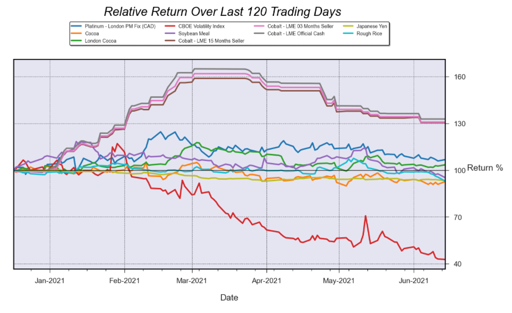

# trendvisualizer
## Visualize trend strength across various markets.

&nbsp;

### The library provides methods to:
  - Extract historical OHLC data for commodities from Norgate Data and S&P 500 from Yahoo Finance.
  - Calculate technical indicators over a range of time periods and aggregate to determine trend strength. 
  - Display charts of markets based on trend strength:

&nbsp;

### Installation
Install from PyPI:
```
$ pip install trendvisualizer
```


&nbsp;

To install in new environment using anaconda:
```
$ conda create --name trendvis
```
Activate new environment
```
$ activate trendvis
```
Install Python
```
(trendvis) $ conda install python==3.8.8
```
Install Spyder
```
(trendvis) $ conda install spyder==4.2.5
```

Install trendvisualizer
```
(trendvis) $ python -m pip install trendvisualizer
```

&nbsp;

### Setup
Import trend module and initialise a DataSet object

```
import trendstrength.trend as trend
mkt = trend.DataSetYahoo('2018-08-10', '2020-10-23')
```
Extract market data, calculate indicators and trend strength
```
mkt.prepyahoo()
```

&nbsp;

####	Display Bar chart
```
mkt.trendbarchart(mkts=20, trend='up')
```


```
mkt.trendbarchart(mkts=20, trend='strong')
```


```
mkt.trendbarchart(mkts=20, trend='neutral')
```


&nbsp;

####	Display Line chart
```
mkt.returnsgraph(days=60, trend='strong')
```

```
mkt.returnsgraph(days=120, mkts=10, trend='down')
```

```
mkt.returnsgraph(days=250, mkts=10, trend='up')
```


&nbsp;

####    Display Multiple chart grid
```
mkt.marketchart(days=60, trend='up')
```

```
mkt.marketchart(days=120, trend='down', norm=False)
```
  
```
mkt.marketchart(days=60, trend='strong', norm=False)
```
  